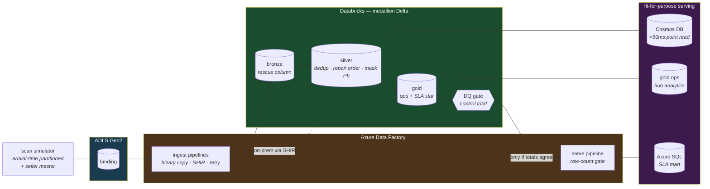

# Parcel Intelligence Lakehouse on Azure

**Azure Data Factory · ADLS Gen2 · Delta Lake · Databricks · Azure SQL Database · Azure Cosmos DB**

India ships ~10 million e-commerce parcels a day. Every parcel leaves a trail of scan
events, and three very different consumers need that trail: a **customer** refreshing
"where is my order?" (a <50 ms point lookup), an **ops manager** (hourly hub dashboards),
and a **finance team** computing SLA penalties (exact, reconciled, historical). No single
database serves all three well — so this is one pipeline feeding three fit-for-purpose
stores: **same events, three access patterns, orchestrated by ADF, transformed once in the
lakehouse, served everywhere.**



> **The meaningful observation (measured, on 200,000 parcels).** A naive pipeline that
> trusted *arrival* order would report **178,249** parcels delivered. The event-time-correct
> pipeline reports **190,014** — an **11,765-parcel (6.2%) undercount**, caused entirely by
> delivery scans that *arrived* after a later-syncing earlier scan and so looked, to arrival
> order, like the parcel was still in transit. The control-total check makes the lakehouse
> and the Azure SQL mart agree on the delivered count before finance can publish, so SLA
> penalties are computed on the corrected number. **Three stores, one truth — because the
> check makes disagreement impossible to publish.** Reproduce it:
> `python simulator/scan_events.py && python quality/measure_divergence.py`.

---

## Results (measured, this repo, reproducible)

Run `python simulator/scan_events.py --parcels 200000` then `python quality/measure_divergence.py`:

| Metric | Value | Source |
|---|---:|---|
| Parcels simulated | 200,000 | simulator |
| Scan events | 1,604,238 | simulator |
| Duplicate scans removed by dedup | 31,615 | measured (dedup rule) |
| Delivered — **event-time correct** | 190,014 | `measure_divergence.py` |
| Delivered — **naive arrival order** | 178,249 | `measure_divergence.py` |
| **Undercount the control total catches** | **11,765 (6.2%)** | `measure_divergence.py` |
| Arrival inversions injected | 70,283 across 61,691 parcels | manifest |
| Automated tests (CI, per PR) | 60 | pytest |

The 6.2% is a property of this simulator's aggressive 5%-per-scan inversion rate, not a
claim about any real carrier — but it is a *real measurement* of what naive processing
would get wrong on *this* data, which is the point: the effect is large enough to matter and
the pipeline catches all of it.

## Quick start

```bash
pip install -r requirements.txt

# Generate the landing zone + measure the headline number — no cloud, no Spark:
python simulator/scan_events.py --parcels 200000
python quality/measure_divergence.py

# The full test suite (simulator + ADF validators need no Java;
# the Spark transform/serving/DQ tests need a JDK):
pytest simulator/tests adf/tests -q
pytest databricks/tests serving/tests quality/tests -q   # needs Java 17
```

## What's verified, and what isn't

No Azure subscription is attached to this repo. What backs the claims is CI (60 tests on
every PR) and the local measurement — not a live deployment.

| Layer | Verified how |
|---|---|
| Simulator | 11 tests: determinism, arrival-vs-event partitioning, each injected defect counted on the files |
| ADF pipelines | 8 tests: valid JSON, **every reference resolves**, **no inline secrets**, retry ≥ 3, alert-and-fail on failure |
| Databricks bronze/silver/gold | 28 chispa tests on **real Spark** (JDK 17): rescue column, earliest-sync dedup, out-of-order *flagged not hidden*, PII salted + mapping, **delivery on event time**, the SLA star |
| Serving | 9 tests: Cosmos point-read doc shape, event-order current status, the row-count copy gate, DDL sanity |
| Data quality | 8 tests: reconciliation, the exact control total, RI severity split, and the **divergence experiment** |

**Not verified without infrastructure** (and the README says so): the ADF pipelines running
in a real factory, the Databricks jobs on a cluster, the JDBC load into Azure SQL, and the
Cosmos point-read latency. Each is built to be deployable — the `<50 ms` and "rebuild-time"
figures would come from provisioning and measuring, which is the remaining step, not a claim
made here.

## The decisions that carry the repo

- **Partition by arrival, not event time.** The whole problem exists because a scan lands
  when it *synced*, not when it *happened*. Everything downstream is built to repair that.
- **Nothing is silently dropped.** Bronze rescues unparseable records; silver quarantines
  bad rows with a *specific* reason. ([databricks/README](databricks/README.md))
- **One dedup rule, stated in three places.** Earliest-sync-per-`scan_id`, identical in the
  simulator's manifest, silver, and the local measurement — so the control total compares
  like with like.
- **Delivery is decided on event time, never arrival** — the correctness crux, in
  `gold_common.parcel_lifecycle`, and the source of the 6.2% the naive method misses.
- **Three stores, each matched to one query.** Cosmos point-reads, Azure SQL joins,
  lakehouse analytics — [docs/access_pattern_matrix.md](docs/access_pattern_matrix.md).
- **Two publish gates.** Copy-integrity (exact row count, M5) *and* the semantic control
  total (delivered counts agree, M6). Both must pass; they catch different failures.
- **Secrets only via Key Vault** — enforced by a CI test that greps every ADF file.

## Repository map

| Path | What's there |
|---|---|
| [`simulator/`](simulator/scan_events.py) | 200K parcels, arrival-time partitioned, every defect counted — 11 tests |
| [`adf/`](adf/README.md) | Import-ready pipelines, SHIR, triggers, Key Vault — 8 validator tests |
| [`databricks/`](databricks/README.md) | bronze → silver → gold, all pure-function + chispa-tested |
| [`serving/`](serving/cosmos/README.md) | Azure SQL SLA mart + Cosmos tracking store — 9 tests |
| [`quality/`](quality/README.md) | DQ gates, the control total, the divergence measurement — 8 tests |
| [`monitoring/`](monitoring/alerts.md) · [`runbooks/`](runbooks/) | Alert rules; pipeline-failure & cosmos-hot-partition runbooks |
| [`docs/`](docs/access_pattern_matrix.md) | Why each query goes to which store |

## Milestones

Each was one PR (M1 landed in the initial commit); the merged PRs are the build history.

| # | Milestone | PR |
|---|---|---|
| M1 | Parcel scan simulator | initial commit |
| M2 | ADF ingestion pipelines | [#1](../../pull/1) |
| M3 | Lakehouse bronze + silver | [#2](../../pull/2) |
| M4 | Lakehouse gold (ops + SLA mart) | [#3](../../pull/3) |
| M5 | Serving: Azure SQL + Cosmos DB | [#4](../../pull/4) |
| M6 | Data quality + control totals | [#5](../../pull/5) |
| M7 | Monitoring + runbooks | [#6](../../pull/6) |
| M8 | Final README + measured results | [#7](../../pull/7) |

## Teardown (avoid Azure charges)

If you deploy this to a real subscription, tear it down when done — the failure mode of a
cloud data platform is a surprise bill:

```bash
# 1. Delete the resource group (removes ADF, storage, Azure SQL, Databricks workspace)
az group delete --name rg-parcel-lakehouse --yes --no-wait

# 2. Cosmos: the free tier is free, but delete the account if you provisioned beyond it
az cosmosdb delete --name parcel-tracking --resource-group rg-parcel-lakehouse --yes

# 3. Confirm nothing survives
az resource list --resource-group rg-parcel-lakehouse -o table
```

Set the **budget alarm on day one**, before any other resource — it is the one guardrail
that catches a left-running Databricks cluster or an accidental Cosmos throughput change
before the invoice does. ([monitoring/alerts.md](monitoring/alerts.md))

## Honest limitations

- **The data is synthetic**, so the DQ checks catch defect shapes the simulator injects and
  I know about. The 6.2% undercount is a real measurement on this data, not a carrier stat.
- **Nothing has run on Azure from this repo.** The transform/serving logic is chispa-tested
  on real Spark in CI; the orchestration and serving JSON are structurally validated. Live
  latency and rebuild-time figures need a provisioned deployment to measure honestly.
- **A separate, complete implementation of this project exists** at
  [`azure-parcel-intelligence`](https://github.com/chinmayharjai/azure-parcel-intelligence);
  this repo is the milestone-by-milestone rebuild with per-component tests and measured
  numbers.
